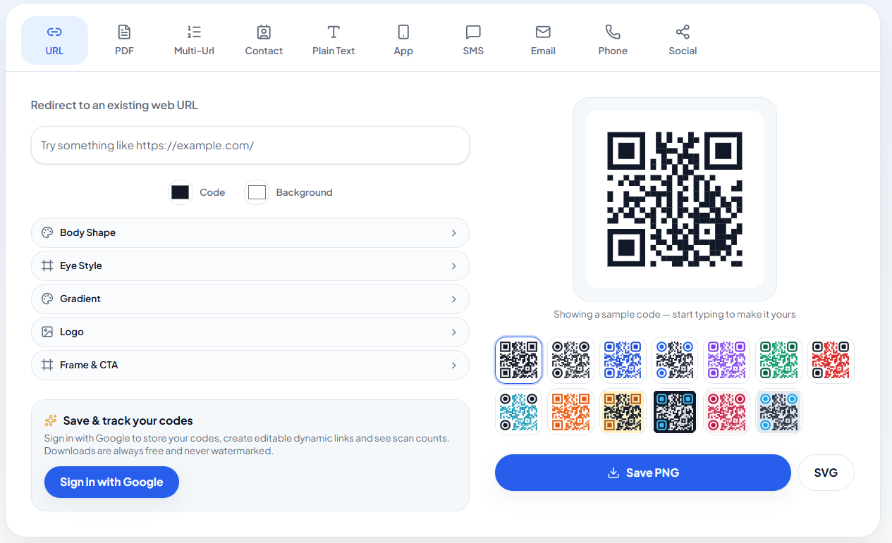
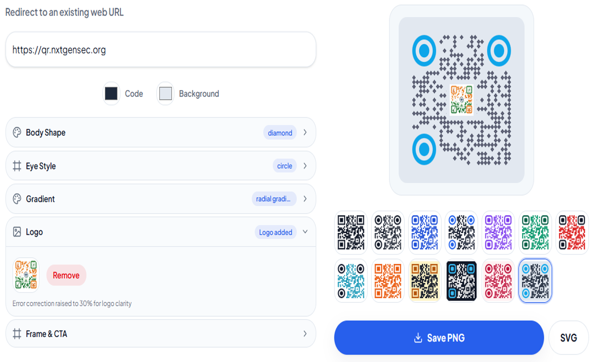
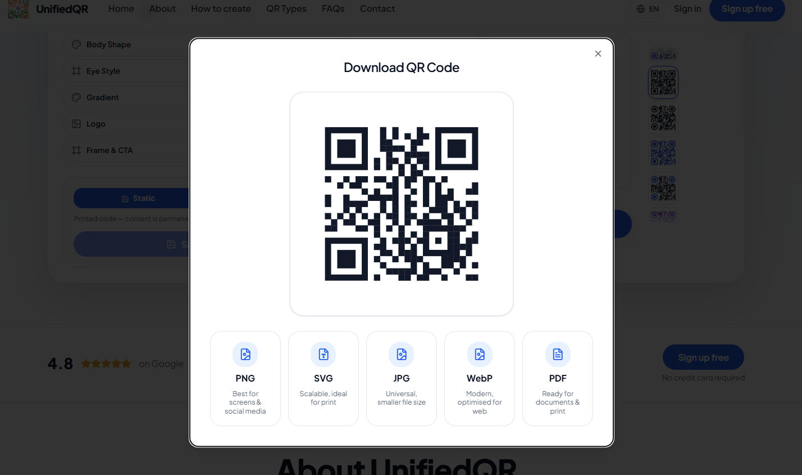

<div align="center">


# UnifiedQR

**Design, generate &amp; track QR codes — no design tool, no developer.**

<br />

[](https://github.com/nxtgensec/Unified-QR/stargazers)
[](https://github.com/nxtgensec/Unified-QR/network/members)
[](https://github.com/nxtgensec/Unified-QR/issues)
[](https://github.com/nxtgensec/Unified-QR/blob/main/LICENSE)
[](https://github.com/nxtgensec/Unified-QR/pulls)

</div>

<br />

### Tech Stack

| Layer | Technology |
|-------|-----------|
| **Frontend** | React 19 + TypeScript |
| **Routing** | TanStack Router (file-based) |
| **Styling** | Tailwind CSS 4 + shadcn/ui |
| **QR Engine** | `qr-code-styling` (canvas/SVG) |
| **Auth & DB** | Supabase (Auth + PostgreSQL) |
| **Payments** | Cashfree (fixed-price orders) |
| **Bundler** | Vite 8 |
| **i18n** | Custom React context (29 languages) |

<br />

<div align="center">
  <a href="#quick-start"></a>&nbsp;&nbsp;
  <a href="#quick-start"></a>&nbsp;&nbsp;
  <a href="#quick-start"></a>
</div>

<br />

<div align="center">
  <code><strong>npm run dev</strong></code> &rarr; <em>your first QR code in under 30 seconds</em>
</div>

<br />

---

## Why UnifiedQR?

<table align="center">
<tr>
<td width="50%" align="center">

**Other QR generators**

Ugly defaults &middot; no analytics &middot; paid walls for basic features &middot; dynamic codes that die when you stop paying &middot; no bulk generation

</td>
<td width="50%" align="center">

**UnifiedQR**

34 designer templates &middot; real-time scan tracking &middot; dynamic codes you own forever &middot; 5 export formats &middot; fully open source, MIT licensed

</td>
</tr>
</table>

<br />

---

## Features

<table>
<tr>
<td width="50%" valign="top">

### Content Types

- **URL** — any web address
- **PDF** — link to a hosted document
- **Multi-URL** — multiple destinations in one code
- **vCard** — name, phone, email, company
- **Text** — free-form notes
- **App Store** — iOS &amp; Android smart links
- **SMS** — pre-filled message
- **Email** — mailto with subject &amp; body
- **Phone** — tel: link
- **Social** — Instagram, YouTube, X

</td>
<td width="50%" valign="top">

### Design Engine

- **34 templates** — curated color &amp; shape combos
- **7 body shapes** — square, dot, rounded, diamond, star, heart, triangle
- **3 eye styles** — square, rounded, circle
- **Custom colors** — foreground, background, eye color
- **Gradients** — linear, radial, configurable angle
- **Logo embedding** — center your brand in any code
- **Frame text** — add a label below the code

</td>
</tr>
<tr>
<td width="50%" valign="top">

### Export Formats

- **SVG** — scalable, print-ready
- **PNG** — 1024px high-res
- **JPG** — lightweight share
- **WebP** — modern compressed
- **PDF** — document-ready via jsPDF

</td>
<td width="50%" valign="top">

### Analytics &amp; Intelligence

- **Today / Yesterday** — daily scan counts
- **Growth %** — compare against previous day
- **Top referrers** — where scans originate
- **Device breakdown** — mobile vs desktop
- **Peak hours heatmap** — when people scan
- **Per-code stats** — drill into any single code

</td>
</tr>
<tr>
<td width="50%" valign="top">

### Workspace

- **Link pages** — one QR, many destinations
- **Drag &amp; drop** — reorder sections &amp; links
- **Custom slugs** — branded short URLs
- **Avatar &amp; branding** — personalise your page

</td>
<td width="50%" valign="top">

### Platform

- **Team collaboration** — shared code libraries
- **Admin panel** — user management &amp; stats
- **29 languages** — full i18n support
- **Mobile-first** — bottom nav, touch-optimised
- **Dark mode** — automatic system preference
- **PWA-ready** — installable on any device

</td>
</tr>
</table>

<br />

---

## Dynamic Codes

> A dynamic QR code stores a **short slug** instead of your final URL.
> When someone scans it, the server looks up the code, records a scan, and
> redirects to the **current destination**. Update the URL, pause, or
> reactivate — everything already printed keeps working.

<table align="center">
<tr>
<td align="center" width="33%">

**1. Print**

Encode `/r/abc123` in your QR code.

</td>
<td align="center" width="33%">

**2. Scan**

Visitor scans &rarr; server records the scan event.

</td>
<td align="center" width="33%">

**3. Redirect**

Visitor lands on your current destination URL.

</td>
</tr>
</table>

<br />

---

## Tech Stack

<table align="center">
<tr>
<td align="center" width="12%">
  <br />
  <sub><strong>React 19</strong></sub>
</td>
<td align="center" width="12%">
  <br />
  <sub><strong>TypeScript</strong></sub>
</td>
<td align="center" width="12%">
  <br />
  <sub><strong>Tailwind v4</strong></sub>
</td>
<td align="center" width="12%">
  <br />
  <sub><strong>TanStack Router</strong></sub>
</td>
<td align="center" width="12%">
  <br />
  <sub><strong>Supabase</strong></sub>
</td>
<td align="center" width="12%">
  <br />
  <sub><strong>Vite</strong></sub>
</td>
<td align="center" width="12%">
  <br />
  <sub><strong>PostgreSQL</strong></sub>
</td>
<td align="center" width="12%">
  <br />
  <sub><strong>Workers</strong></sub>
</td>
</tr>
</table>

<br />

---

## Quick Start

```sh
# Clone
git clone https://github.com/nxtgensec/Unified-QR.git
cd Unified-QR

# Install
npm ci

# Configure
cp .env.local.example .env.local
# Edit .env.local with your Supabase + Cashfree keys

# Run
npm run dev
```

<div align="center">

**http://localhost:8080**

</div>

<br />

---

## Environment Variables

| Variable                        | Scope  | Description               |
| ------------------------------- | ------ | ------------------------- |
| `SUPABASE_URL`                  | server | Supabase API URL          |
| `SUPABASE_PUBLISHABLE_KEY`      | server | Client-safe key           |
| `SUPABASE_SERVICE_ROLE_KEY`     | server | Admin key — never expose  |
| `VITE_SUPABASE_URL`             | client | Exposed API URL           |
| `VITE_SUPABASE_PUBLISHABLE_KEY` | client | Exposed publishable key   |
| `CASHFREE_ENV`                  | server | `sandbox` or `production` |
| `CASHFREE_CLIENT_ID`            | server | Merchant client ID        |
| `CASHFREE_CLIENT_SECRET`        | server | Merchant secret           |
| `CASHFREE_CURRENCY`             | server | Default `INR`             |
| `CASHFREE_RETURN_URL`           | server | Post-checkout redirect    |

<br />

---

## Database

```sh
supabase login
supabase link --project-ref <your-ref>
npm run db:push
```

| Table           | Purpose                                      |
| --------------- | -------------------------------------------- |
| `profiles`      | User name, avatar, plan                      |
| `qr_codes`      | Saved codes + design fields + dynamic fields |
| `scans`         | One row per scan event                       |
| `link_pages`    | Bio page definitions                         |
| `link_sections` | Sections within a page                       |
| `link_items`    | Individual links within sections             |

<br />

---

## Project Structure

```
src/
├── components/
│   ├── app/           → Authenticated shell (sidebar, nav)
│   ├── qr/            → Generator widget, forms, type tabs
│   ├── site/          → Public header, footer
│   └── ui/            → shadcn/ui primitives
├── lib/               → QR engine, i18n, codes, admin
├── routes/            → TanStack file-based routes
│   ├── _authenticated/ → Dashboard, create, analytics, links
│   └── *.tsx          → Public pages + /r/:slug redirect
└── integrations/      → Supabase + Cashfree clients
```

<br />

---

## Scripts

| Command             | Description                           |
| ------------------- | ------------------------------------- |
| `npm run dev`       | Dev server at http://localhost:8080   |
| `npm run build`     | Production build (Cloudflare Workers) |
| `npm run preview`   | Preview prod build locally            |
| `npm run lint`      | ESLint + Prettier                     |
| `npm run typecheck` | Strict TypeScript check               |
| `npm run db:push`   | Apply Supabase migrations             |

<br />

---

## Deployment

```sh
npm run build
npx wrangler deploy
```

Set environment variables in Cloudflare dashboard. Static assets under `public/` emit alongside the worker bundle.

<br />

---

## Roadmap

Planned work is tracked in [docs/development-status.md](docs/development-status.md).

<br />

---

<div align="center">

**[Contributing](CONTRIBUTING.md)** &middot; **[Security](SECURITY.md)** &middot; **[License (MIT)](LICENSE)**

<br />

Built by the [UnifiedQR](https://github.com/nxtgensec) team

</div>
