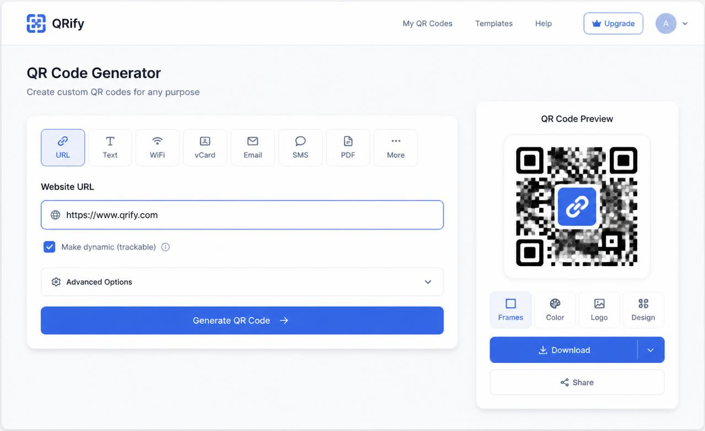
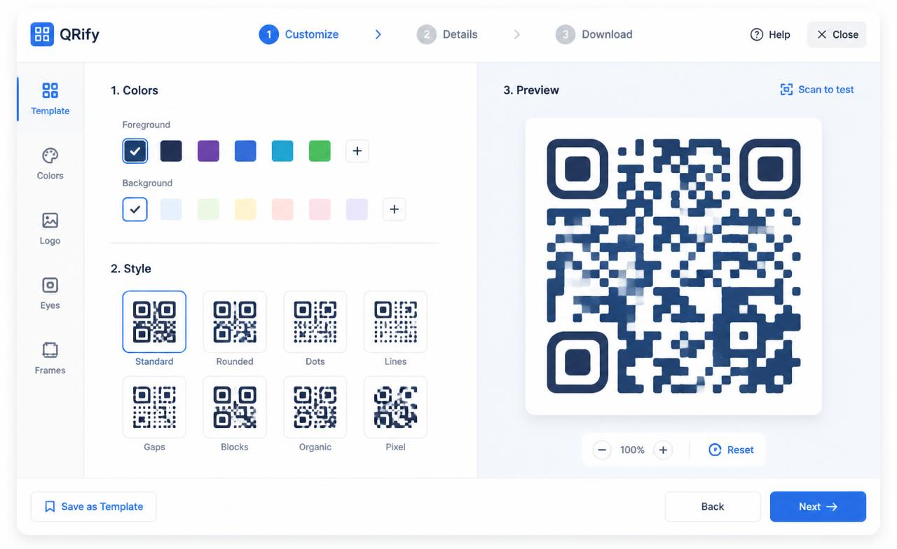
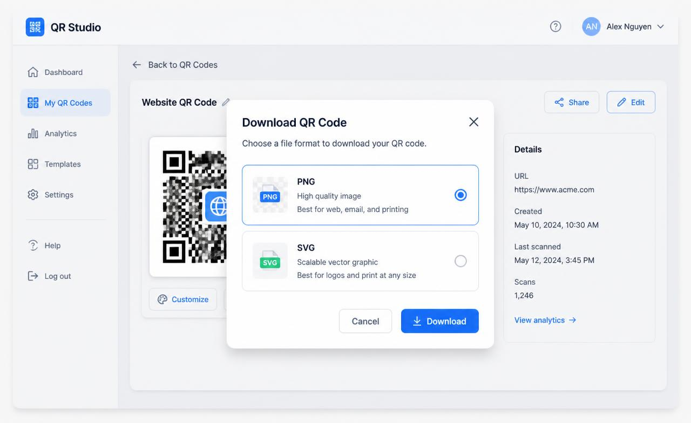

<div align="center">

<picture>
  <source media="(prefers-color-scheme: dark)" srcset="https://img.shields.io/badge/UnifiedQR-000000?style=for-the-badge&logo=qrcode&logoColor=white" />
  
</picture>


<h1 style="font-size:2.8em; margin-bottom:0;">UnifiedQR</h1>

<p style="font-size:1.2em; color:#6b7280; margin-top:0;">
  Design, generate &amp; track QR codes — no design tool, no developer.
</p>

<br />

<a href="https://github.com/nxtgensec/Unified-QR/blob/main/LICENSE">
  
</a>


</div>

<br />

<div align="center">
  <a href="#quick-start"></a>&nbsp;&nbsp;
  <a href="#quick-start"></a>&nbsp;&nbsp;
  <a href="#quick-start"></a>
</div>

<br />

<div align="center">
  <code><strong>npm run dev</strong></code> → <em>your first QR code in under 30 seconds</em>
</div>

<br />

---

<br />

<div align="center">
<h2>⚡ The Problem</h2>
</div>

<table align="center">
<tr>
<td width="50%" align="center">

**Existing QR generators are broken.**

Ugly defaults. No analytics. Paid walls for basic features.
Dynamic codes that stop working when you cancel.

</td>
<td width="50%" align="center">

**UnifiedQR fixes all of it.**

24 designer templates. Real-time scan tracking.
Dynamic codes you own forever. Bulk generation.
Open source. MIT licensed.

</td>
</tr>
</table>

<br />

---

<br />

<div align="center">
<h2>🧩 Features</h2>
</div>

<table>
<tr>
<td width="50%" valign="top">

#### Content Types
- **URL** — any web address
- **PDF** — link to a hosted document
- **Multi-URL** — multiple destinations
- **vCard** — name, phone, email, company
- **Text** — free-form notes
- **App Store** — iOS & Android links
- **SMS** — pre-filled message
- **Email** — mailto with subject/body
- **Phone** — tel: link
- **Social** — Instagram, YouTube, X

</td>
<td width="50%" valign="top">

#### Design Engine
- **24 templates** — curated color & shape combos
- **7 body shapes** — square, dot, rounded, diamond, star, heart, triangle
- **3 eye styles** — square, rounded, circle
- **Custom colors** — foreground, background, eye color
- **Gradients** — linear, radial, configurable angle
- **Logo embedding** — center your brand in any code
- **Frame text** — add a label below the code

</td>
</tr>
<tr>
<td width="50%" valign="top">

#### Export Formats
- **SVG** — scalable, print-ready
- **PNG** — 1024px high-res
- **JPG** — lightweight share
- **WebP** — modern compressed
- **PDF** — document-ready via jsPDF

</td>
<td width="50%" valign="top">

#### Analytics & Intelligence
- **Today / Yesterday** — daily scan counts
- **Growth %** — compare against previous day
- **Top referrers** — where scans originate
- **Device breakdown** — mobile vs desktop
- **Peak hours heatmap** — when people scan
- **Per-code stats** — drill into any single code

</td>
</tr>
</table>

<br />

---

<br />

<div align="center">
<h2>🔗 Dynamic Codes</h2>
</div>

> A dynamic QR code stores a **short slug** instead of your final URL.
> When someone scans it, the server looks up the code, records a scan, and
> redirects to the **current destination**. Update the URL, pause, or
> reactivate — everything already printed keeps working.

<br />

<table>
<tr>
<td align="center" width="33%">

**1. Print**

Encode `/r/abc123` in your QR code.

</td>
<td align="center" width="33%">

**2. Scan**

Visitor scans → server records the scan event.

</td>
<td align="center" width="33%">

**3. Redirect**

Visitor lands on your current destination URL.

</td>
</tr>
</table>

<br />

---

<br />

<div align="center">
<h2>🛠 Tech Stack</h2>
</div>

<table align="center">
<tr>
<td align="center" width="14%">
  <br />
  <strong>React 19</strong>
</td>
<td align="center" width="14%">
  <br />
  <strong>TypeScript</strong>
</td>
<td align="center" width="14%">
  <br />
  <strong>Tailwind v4</strong>
</td>
<td align="center" width="14%">
  <br />
  <strong>Supabase</strong>
</td>
<td align="center" width="14%">
  <br />
  <strong>Vite</strong>
</td>
<td align="center" width="14%">
  <br />
  <strong>PostgreSQL</strong>
</td>
<td align="center" width="14%">
  <br />
  <strong>Workers</strong>
</td>
</tr>
</table>

<br />

---

<br />

<div align="center">
<h2>🚀 Quick Start</h2>
</div>

```sh
# Clone
git clone https://github.com/nxtgensec/Unified-QR.git
cd Unified-QR

# Install
npm ci

# Configure
cp .env.local.example .env.local
# Edit .env.local with your Supabase + Cashfree keys

# Run
npm run dev
```

<div align="center">

**→ http://localhost:8080**

</div>

<br />

---

<br />

<div align="center">
<h2>📋 Environment Variables</h2>
</div>

| Variable | Scope | Description |
| --- | --- | --- |
| `SUPABASE_URL` | server | Supabase API URL |
| `SUPABASE_PUBLISHABLE_KEY` | server | Client-safe key |
| `SUPABASE_SERVICE_ROLE_KEY` | server | Admin key — never expose |
| `VITE_SUPABASE_URL` | client | Exposed API URL |
| `VITE_SUPABASE_PUBLISHABLE_KEY` | client | Exposed publishable key |
| `CASHFREE_ENV` | server | `sandbox` or `production` |
| `CASHFREE_CLIENT_ID` | server | Merchant client ID |
| `CASHFREE_CLIENT_SECRET` | server | Merchant secret |
| `CASHFREE_CURRENCY` | server | Default `INR` |
| `CASHFREE_RETURN_URL` | server | Post-checkout redirect |

<br />

---

<br />

<div align="center">
<h2>🗄 Database</h2>
</div>

```sh
supabase login
supabase link --project-ref <your-ref>
npm run db:push
```

| Table | Purpose |
| --- | --- |
| `profiles` | User name, avatar, plan |
| `qr_codes` | Saved codes + design fields + dynamic fields |
| `scans` | One row per scan event |
| `link_pages` | Bio page definitions |
| `link_sections` | Sections within a page |
| `link_items` | Individual links within sections |

<br />

---

<br />

<div align="center">
<h2>📁 Project Structure</h2>
</div>

```
src/
├── components/
│   ├── app/           → Authenticated shell (sidebar, nav)
│   ├── qr/            → Generator widget, forms, type tabs
│   ├── site/          → Public header, footer
│   └── ui/            → shadcn/ui primitives
├── lib/               → QR engine, i18n, codes, admin
├── routes/            → TanStack file-based routes
│   ├── _authenticated/ → Dashboard, create, analytics, links
│   └── *.tsx          → Public pages + /r/:slug redirect
└── integrations/      → Supabase + Cashfree clients
```

<br />

---

<br />

<div align="center">
<h2>⌨️ Scripts</h2>
</div>

| Command | Description |
| --- | --- |
| `npm run dev` | Dev server → http://localhost:8080 |
| `npm run build` | Production build (Cloudflare Workers) |
| `npm run preview` | Preview prod build locally |
| `npm run lint` | ESLint |
| `npm run format` | Prettier |
| `npm run typecheck` | `tsc --noEmit` |
| `npm run db:push` | Apply Supabase migrations |

<br />

---

<br />

<div align="center">
<h2>📦 Deployment</h2>
</div>

```sh
npm run build
npx wrangler deploy
```

Set environment variables in Cloudflare dashboard. Static assets under `public/` emit alongside the worker bundle.

<br />

---

<br />

<div align="center">
<h2>🗺 Roadmap</h2>
</div>

Planned work is tracked in [docs/development-status.md](docs/development-status.md).

<br />

---

<br />

<div align="center">

**[Contributing](CONTRIBUTING.md)** · **[Security](SECURITY.md)** · **[License (MIT)](LICENSE)**

<br />

Made with ❤️ by the UnifiedQR contributors

</div>
